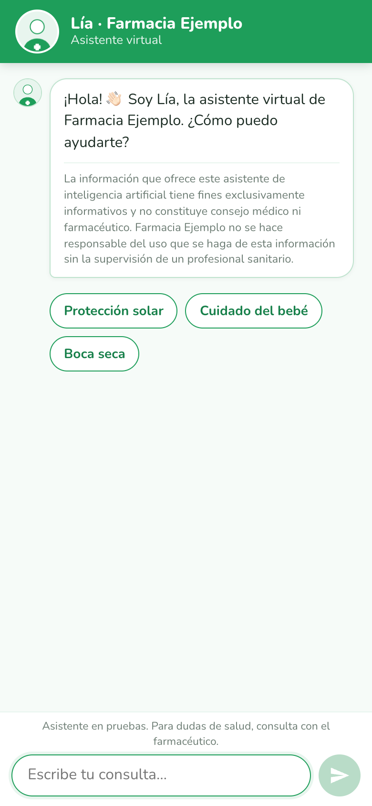
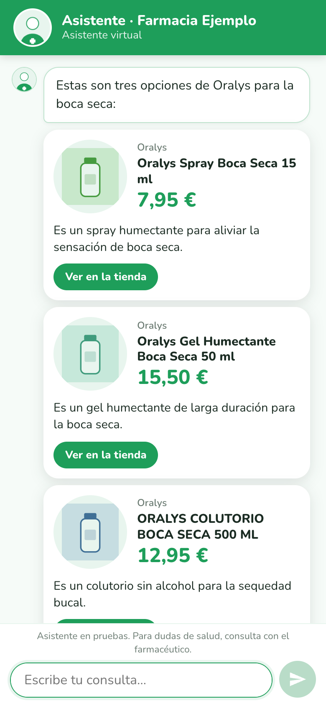
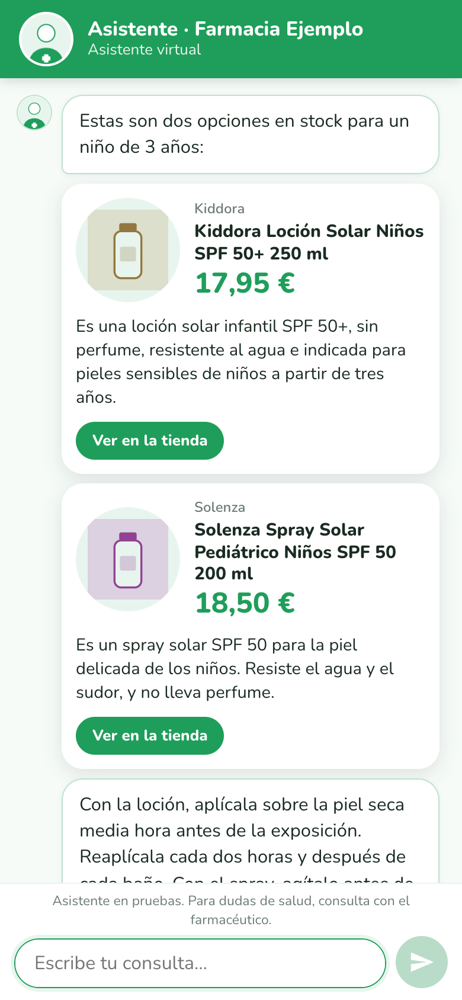
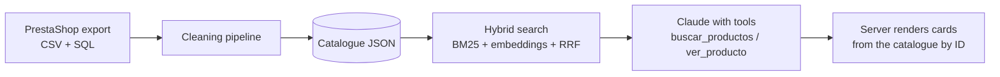

# Pharmacy AI Assistant

A conversational shopping assistant for an online pharmacy, built on hybrid search (BM25 + multilingual embeddings) and Claude with tool use. It answers in Spanish, recommends products from a product catalogue, and shows them as cards whose names, prices and links come from the catalogue, never from the model.

<p align="center">
  
  
  
</p>

> This repository runs on a **synthetic catalogue** of about 100 invented products. The real catalogue it was developed against is not included. That is enough to run and test everything here, but not to judge how the assistant would do with real customers; see [Evaluation](#evaluation).

## The problem

Pharmacy and parapharmacy stores have thousands of products with inconsistent data: missing descriptions, HTML leftovers, brand names spelled five ways, variants that differ only by SPF or size. A chatbot on top of that data tends to do two bad things: invent product details, and mix up variants. This project is about making the data trustworthy first, then constraining the model so it cannot improvise where it matters.

## How it works



**1. Catalogue cleaning** (`convertir_json.py`, `fusionar_sql.py`, `limpiar_catalogo.py`). Merges the stock CSV with a SQL export that adds descriptions and brands, strips HTML, splits descriptions into sections (description, directions for use, warnings), normalises brand names, derives `en_stock` from quantity, and flags junk text. Each product gets a `nivel_info` field: `completa` (300+ characters of description), `parcial` (100 to 299) or `minima` (less than 100, empty, or just repeating the name). The assistant is instructed to say it has no information about those, instead of guessing.

**2. Hybrid search** (`buscar.py`). BM25 over name, brand, category and short description handles exact queries ("solenza fluido"). A local multilingual embedding model (`intfloat/multilingual-e5-base`) handles needs ("something for dry mouth"). The two rankings are merged with Reciprocal Rank Fusion. Stock filtering happens before ranking, variants are grouped so the same product does not appear five times, and they are deliberately **not** grouped when they differ in SPF, size, unit count or age. There is also a brand filter (case- and accent-insensitive, partial names allowed; it warns the model when the brand does not exist or has nothing in stock) and a price-ordered mode (top 30 by relevance, then sorted by price).

**3. Agent with tools** (`asistente.py`, `prompt_sistema.md`). Claude gets two tools: `buscar_productos` to find candidates and `ver_producto` to read the full record (directions, warnings) before explaining how a product is used. The system prompt forbids describing a product without that information, giving doses, assessing symptoms, or quoting any phone number other than 112. It also has to say it is an AI.

**4. Cards rendered by the server** (`servidor.py`, `static/`). The model writes a marker like `[[producto:123]]` plus one short sentence. The server replaces it with a card built from the catalogue (name, brand, price, stock, link). A marker whose ID was not returned by the tools in that conversation is dropped and logged. This removed a whole class of errors seen in early tests: misspelled product names and copied prices.

## Run it

Requires Python 3.12 and an Anthropic API key.

```bash
python3.12 -m venv .venv312
.venv312/bin/pip install -r requirements.txt
cp .env.example .env          # then fill in ANTHROPIC_API_KEY and DEMO_PASSWORD
.venv312/bin/python generar_catalogo_ejemplo.py
.venv312/bin/python generar_vectores.py
./arrancar_demo.sh
```

`arrancar_demo.sh` starts the server on `localhost:8000` and opens a temporary public tunnel for demos, so it needs `cloudflared` installed (for example `brew install cloudflared`) and refuses to start without `ANTHROPIC_API_KEY` and `DEMO_PASSWORD`. To run only locally, without a tunnel, export the variables from `.env` and run `.venv312/bin/python servidor.py`. The first run downloads the embedding model. The sample catalogue is already committed and `generar_catalogo_ejemplo.py` regenerates it identically (fixed seed), so that step is optional. Optional variables (`ASISTENTE_NOMBRE`, `FARMACIA_NOMBRE`, `MARCA_PROPIA`, `URL_TIENDA_BASE`, `CATALOGO_RUTA`, `WHATSAPP_NUMERO`, `LIMITE_MENSAJES`) are documented in `.env.example`. To export a catalogue from your own PrestaShop store, see [`docs/exportar_catalogo_prestashop.md`](docs/exportar_catalogo_prestashop.md).

## Evaluation

There are two layers.

**Retrieval** (`evaluar.py`, `evaluacion.json`): recall@8, meaning whether any expected product appears in the top 8 results. On the synthetic catalogue it is 14/14. Treat that as a smoke test, not a quality measure: the catalogue has about 100 products, and I wrote both the catalogue and the queries.

**Behaviour** (`ejecutar_casos.py`, `casos_prueba.md`): twelve conversations covering product search, brand lookups, usage questions, an out-of-stock variant, a product with minimal information, price ordering, dosing and symptom questions, a prompt-injection attempt and a non-existent brand. Each is run three times and graded by a second model against four criteria: tools used before making claims, exact product names, no dosing or symptom assessment, and no claims that do not come from the tools.

**Limits of these numbers.** Everything here runs on the synthetic catalogue, so none of it says how the assistant would do with real customer questions. The behaviour suite is twelve cases with three repetitions each: a small sample with a lot of noise. The judge is an LLM with its own biases. Part of the prompt was tuned looking at these same cases, so they are not a clean held-out set.

## Known limitations

- The local embedding model is the main memory cost. Measured on macOS (Apple M1 Pro) with the 103-product sample catalogue and the model forced onto the CPU, the process used about 0.85 GB resident after loading the model and about 1.2 GB after five different searches, with no further growth. These are in-process measurements of the same search function the server uses, not a load test, and I have not measured Linux or the real catalogue. That is enough to rule out the smallest hosting plans. Switching to an embeddings API would shrink the deployment, but it would require re-embedding and re-evaluating.
- Search is weaker on vague descriptive queries than on brand or product queries. The model usually compensates by reformulating, but retrieval alone is not a replacement for a production site search.
- Conversation logs are written to local files. A real deployment would need a retention policy and a privacy review, since users may describe health information.
- Product data quality is a ceiling. Where the catalogue has no description, the assistant can only give name, brand, price and stock.
- This is a prototype. It is not a medical device and does not replace a pharmacist.

## What I would do next

Build an evaluation set from real customer questions, with expected products labelled by the pharmacy team. Add pharmacist-written recommendation guides for common situations so the assistant reflects the store's own advice. Measure a pilot with real traffic: conversations, resolved questions, clicks to product pages.

## About the development

I designed the architecture, the evaluation setup and the data pipeline, and iterated on the results. Most of the code was written with Claude Code, and I reviewed it, ran it and made the design decisions described above.

## License

MIT. See [`LICENSE`](LICENSE).

Author: Javier Milagro · [GitHub](https://github.com/JaviMilagro)
